<div align="center">

# ⚡ BoltZyy

**Vibe Coder • AI-Assisted Developer • Professional Debugger™ (no lie frfr)**


<br>

<a href="https://github.com/BoltZyy">
  
</a>
<a href="https://discord.com/users/1091901409668124805">
  
</a>

</div>

---

## 👋 About Me

Yo, I'm **BoltZyy**.

I'm mostly a vibe coder — I build things with code, AI, curiosity, and an unreasonable amount of trial and error. Lately that means serverless Discord bots with AI chat, economy systems, and moderation, plus an OpenAI-compatible gateway that routes across multiple AI providers.

I don't always code because I have to. Sometimes I code because real life is busy, noisy, and exhausting, and coding is just a nice little escape route.

> *Coding isn't always the destination. Sometimes it's the escape.*

I also genuinely enjoy building things together with AI. I throw an idea at it, let it challenge my approach, break things, fix things, and somehow we eventually end up with something that works.

And yes... sometimes the code works. Sometimes the code works after 47 increasingly questionable fixes.

That's the process. 😭

---

## 🧠 My Vibe Coding Process

```text
Idea
  ↓
Ask AI
  ↓
Build
  ↓
Something breaks
  ↓
Ask AI again
  ↓
"Wait... why does this work?"
  ↓
Fix it
  ↓
Build more
  ↓
Something else breaks
  ↓
Repeat
```

---

## 🛠️ What I Build

**🤖 AI & Automation**


**☁️ Backend & Serverless**


**💻 Code**


---

## 🚀 Featured Projects

| Project | What it is | Status |
| :------ | :--------- | :----- |
| 🤖 [**Vercel-dc**](https://github.com/BoltZyy/Vercel-dc) | My most feature-rich Discord bot. A multi-purpose serverless bot with AI chat, a market & economy engine, utilities, and moderation. It runs on Vercel via HTTP Interactions — no WebSocket gateway, no server that has to stay up 24/7.<br>**Stack:** Node.js · Redis · QStash · [Website](https://vercel-dc.vercel.app) | ⭐ Flagship |
| 🧠 [**Vercel-gateway**](https://github.com/BoltZyy/Vercel-gateway) | A serverless AI router/proxy with automatic fallback across providers (Gemini → Groq → Cerebras → OpenRouter), exposed as an OpenAI Chat Completions-compatible endpoint. Works as a custom endpoint in SillyTavern / Saucepan.ai. An agentic version, [Vercel-agentic-gateway](https://github.com/BoltZyy/Vercel-agentic-gateway), is on the way. | 🔧 Active |
| 🤖 [**Discord-bot-vercel**](https://github.com/BoltZyy/Discord-bot-vercel) | One of my earlier serverless Discord bots. Older architecture, older experiments, but part of the journey that led to the newer projects. Partly this is the idea to my serverless bot tho| 📦 Legacy |
| 🎨 [**Theme-bolTz**](https://github.com/BoltZyy/Theme-bolTz) | A collection of custom themes and visual experiments. Currently focused on Vendetta, with Telegram support planned. | 🎨 Ongoing |

<details>
<summary><b>How Vercel-gateway works</b></summary>

<br>

```text
Your App
   ↓
Vercel Gateway
   ↓
AI Provider
   ↓
Response
```

Because apparently calling one AI API directly wasn't complicated enough.

</details>

> **Vercel-dc** is built with a healthy combination of actual engineering and:
> *"Coba tanya AI dulu."* ("Just ask the AI first.") 😭

---

## 📊 GitHub Analytics

<div align="center">




</div>

---

## 🎮 Discord

<div align="center">

<a href="https://discord.com/users/1091901409668124805">
  
</a>

</div>

---

<div align="center">

⚡ *Built with curiosity, AI, and a need to escape reality for a bit.*

Thanks for stopping by.

PS: If you ask me if this shi build by AI or not, then yes. But to be clear, the concept was all mine and AI just polished it so it can save up much time, fr.

</div>
